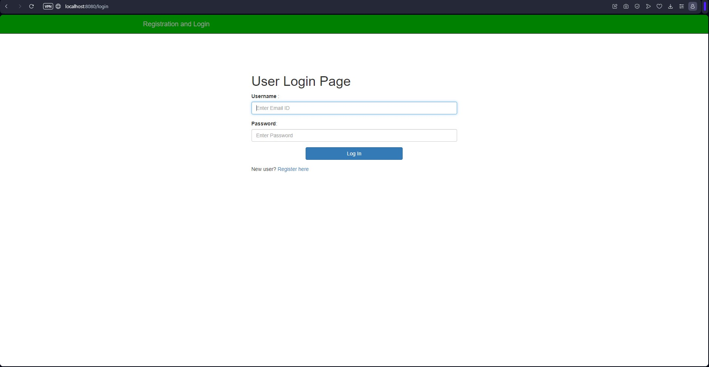

# Spring Boot Online Store

A full Spring Boot Online Store project. h2 used as database. Thymeleaf used for front-end. Working on "localhost:8080".
Features:
- Register-login-logout(with spring security)
- Basket for buying selected items
- User and Admin login(with spring security)
- Admins can buy,add,update and remove items(CRUD)
- Users can only buy items.

# Presentation of App :
App have a Login Page for users to login as admin or regular user.

From Login Page user can navigate to the Register Page for registry.

After a succesfull login user will see the Main Page where users can log out from account, navigate to marketplace and Basket.

In marketplace user will see items from database. Items have name, price and quantity. Users can add the items into basket for any number as long as they don't want to add more than the number of quantity. Right side of the items they have "add" button. When clicked items will be added into basket and user will be navigated to basket page.

Users Can buy items that they choosed with "buy" button. Total price displays bottom right of the table. Also user can remove items from basket if they changed their mind.

That is all for regular user side of app.

If any user detected as admin they will see the main page without differences. But in marketplace they can remove and update items. Furthermore new items can be added.

Item add page:

For security side app have encryption system for user passwords.

If users are not logged in, marketplaceor main or basket is not visible for them. also regular users can't access to admin Marketplace page and options.
